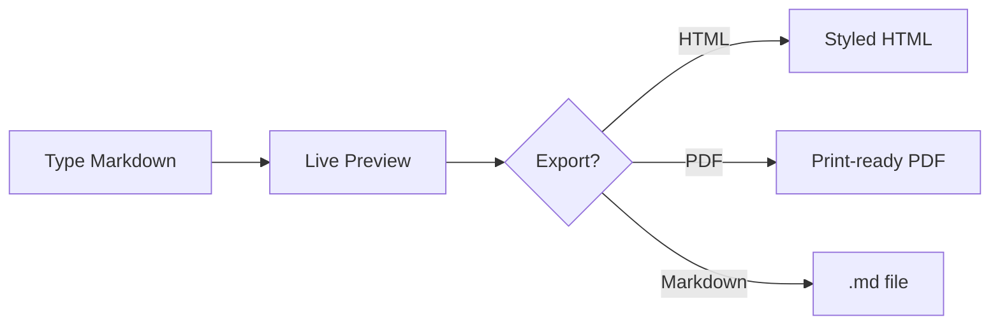

# MarkSight

An open source markdown editor with real-time preview, a smart formatting toolbar, keyboard shortcuts, a document outline, and Markdown/HTML/PDF export.

🔗 **Live:** [marksight.laramateo.com](https://marksight.laramateo.com)

## About

MarkSight is a free, open source markdown editor that runs entirely in your
browser — no account, no server-side storage. Documents are persisted to
`localStorage` and exports are generated client-side, so your writing never
leaves your device. It was created by [Lara Mateo](https://laramateo.com) and
is developed in the open with the help of community contributors.

## Features

- **Live preview** — CodeMirror editor with an instantly-rendered preview pane
- **Smart toolbar** — context-aware formatting that detects and toggles existing markdown
- **Keyboard shortcuts** — bold (⌘B), italic (⌘I), strikethrough (⌘U), link (⌘K), inline code (⌘`), headings (⌘⇧1–3), lists, and more
- **Document outline** — auto-generated, clickable heading navigation that scrolls the preview
- **Export** — download the raw Markdown source or styled HTML, print to PDF, or preview the HTML in a new tab
- **GitHub-flavored markdown** — tables, task lists, strikethrough (via `remark-gfm`)
- **Syntax highlighting** — fenced code blocks rendered with Prism
- **Mermaid diagrams** — fenced `mermaid` blocks render as live SVG in the preview and exports, themeable per diagram via `%%{init}%%` directives or YAML frontmatter
- **Light / dark theme** — system-aware, persisted across sessions
- **Local persistence** — your document is saved to `localStorage` automatically

A fenced `mermaid` block renders as a diagram:



## Tech stack

- [Next.js 15](https://nextjs.org/) (App Router) + [React 19](https://react.dev/)
- [Tailwind CSS v4](https://tailwindcss.com/) + [shadcn/ui](https://ui.shadcn.com/) primitives
- [CodeMirror](https://codemirror.net/) (`@uiw/react-codemirror`) for editing
- [react-markdown](https://github.com/remarkjs/react-markdown) + `remark-gfm` for rendering
- [Mermaid](https://mermaid.js.org/) for diagram rendering
- [next-themes](https://github.com/pacocoursey/next-themes) for theming

## Getting started

```bash
npm install
npm run dev      # start the dev server at http://localhost:3000
```

Other scripts:

```bash
npm run build    # production build
npm run start    # serve the production build
npm run lint     # run ESLint
```

### Regenerating brand assets

App icons and social images are generated from inline SVG with `sharp`:

```bash
node scripts/generate-assets.mjs
```

This writes the manifest icons (`public/icon*.png`) and the Next.js
metadata images (`src/app/apple-icon.png`, `opengraph-image.png`, `twitter-image.png`).

## Project structure

```
src/
├── app/              # App Router entry (layout, page, metadata, route assets)
├── components/       # UI components (editor, preview, toolbar, sidebar, …)
│   └── ui/           # shadcn/ui primitives
├── contexts/         # React context providers
├── hooks/            # custom hooks
└── lib/              # utilities (slugify, local storage, syntax highlighter, …)
```

## Contributing

Contributions are welcome — whether it's a bug report, a feature idea, a docs
fix, or a pull request. See the [contributing guide](./CONTRIBUTING.md) for how
to set up the project and submit changes, and please follow our
[Code of Conduct](./CODE_OF_CONDUCT.md).

New here? Look for issues labelled
[`good first issue`](https://github.com/Rinava/MarkSight/issues?q=is%3Aopen+label%3A%22good+first+issue%22).

## Community

Questions, ideas, or just want to show what you built with MarkSight? Join the
conversation in [GitHub Discussions](https://github.com/Rinava/MarkSight/discussions).
For bugs and feature requests, open an
[issue](https://github.com/Rinava/MarkSight/issues).

## Contributors

Thanks to everyone who has helped make MarkSight better:

<a href="https://github.com/Rinava/MarkSight/graphs/contributors">
  
</a>

Want to see yourself here? Start with the
[contributing guide](./CONTRIBUTING.md).

## Author

MarkSight was created and is maintained by
**[Lara Mateo](https://laramateo.com)** ([@Rinava](https://github.com/Rinava)).

## License

See [LICENSE](./LICENSE).
