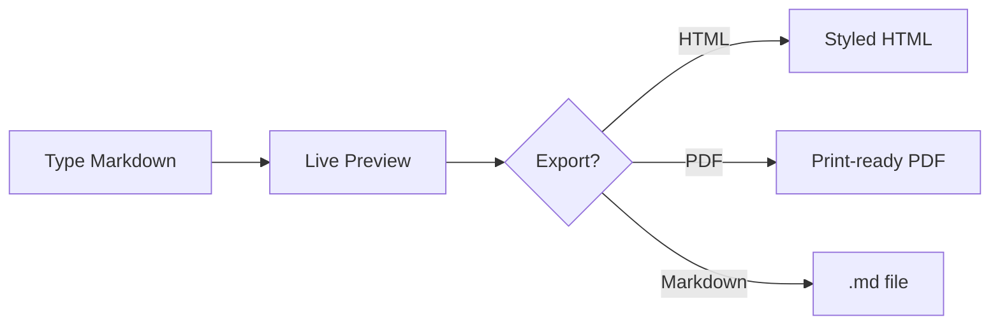

# MarkSight

**Turn any Markdown document into an installable [Claude Agent Skill](https://code.claude.com/docs/en/skills) — one click, in your browser.** MarkSight is a free, open source Markdown editor whose core doubles as a remote [MCP](https://modelcontextprotocol.io) server that Claude Code can call directly. Live preview, GFM, Mermaid diagrams, and Markdown/HTML/PDF export come with it.

🔗 **Live (no signup):** [marksight.laramateo.com](https://marksight.laramateo.com)  ·  🧩 One-click `.skill` export  ·  🔌 Built-in MCP server  ·  🔒 100% client-side

<!-- Demo GIF slot — drop a ≤2 MB clip at docs/demo.gif (type markdown → ⌘⇧K → .skill downloads → `claude mcp add`), then uncomment the line below. -->
<!--  -->

> ⭐ If MarkSight is useful to you, starring the repo helps others find it.

## Quick start

**Use it — nothing to install:**

1. Open [marksight.laramateo.com](https://marksight.laramateo.com), write or paste Markdown, and press **⌘⇧K** — an installable `.skill` bundle downloads immediately.
2. Or add MarkSight's MCP server to Claude Code and let Claude build and validate skills for you:

   ```bash
   claude mcp add --transport http marksight https://marksight.laramateo.com/api/mcp
   ```

   Then ask Claude to turn Markdown into a skill or convert it to HTML. Tools: `create_skill`, `validate_skill`, `markdown_to_html`, `document_outline`, `document_metrics`.

Want to run MarkSight locally or contribute? See [Getting started](#getting-started).

## About

MarkSight is a free, open source markdown editor that runs entirely in your
browser — no account, no server-side storage. Documents are persisted to
`localStorage` and exports are generated client-side, so your writing never
leaves your device. It was created by [Lara Mateo](https://laramateo.com) and
is developed in the open with the help of community contributors.

## Features

- **Live preview** — CodeMirror editor with an instantly-rendered preview pane
- **Smart toolbar** — context-aware formatting that detects and toggles existing markdown
- **Keyboard shortcuts** — bold (⌘B), italic (⌘I), strikethrough (⌘U), link (⌘K), inline code (⌘`), headings (⌘⇧1–3), lists, and more
- **Document outline** — auto-generated, clickable heading navigation that scrolls the preview
- **Export** — download the raw Markdown source or styled HTML, print to PDF, or preview the HTML in a new tab
- **Skill Creator** — package your document as an [Agent Skill](https://code.claude.com/docs/en/skills) (⌘⇧K) that Claude and other AIs can receive: copy the generated `SKILL.md` or download a ready-to-install `.skill` bundle. Import existing skills from a `.skill`/`.zip` file or straight from GitHub-hosted marketplaces (like [anthropics/skills](https://github.com/anthropics/skills)), modify them, and re-export with bundled files preserved
- **GitHub-flavored markdown** — tables, task lists, strikethrough (via `remark-gfm`)
- **Syntax highlighting** — fenced code blocks rendered with Prism
- **Mermaid diagrams** — fenced `mermaid` blocks render as live SVG in the preview and exports, themeable per diagram via `%%{init}%%` directives or YAML frontmatter
- **Light / dark theme** — system-aware, persisted across sessions
- **Local persistence** — your document is saved to `localStorage` automatically

A fenced `mermaid` block renders as a diagram:



## Tech stack

- [Next.js 16](https://nextjs.org/) (App Router) + [React 19](https://react.dev/)
- [Tailwind CSS v4](https://tailwindcss.com/) + [shadcn/ui](https://ui.shadcn.com/) primitives
- [CodeMirror](https://codemirror.net/) (`@uiw/react-codemirror`) for editing
- [react-markdown](https://github.com/remarkjs/react-markdown) + `remark-gfm` for rendering
- [Mermaid](https://mermaid.js.org/) for diagram rendering
- [next-themes](https://github.com/pacocoursey/next-themes) for theming

## Getting started

```bash
npm install
npm run dev      # start the dev server at http://localhost:3000
```

Other scripts:

```bash
npm run build    # production build
npm run start    # serve the production build
npm run lint     # run ESLint
```

### Exporting a document as an Agent Skill

One click: hit the package icon in the preview toolbar (or ⌘⇧K) and a
validated `<name>.skill` bundle downloads immediately — metadata is derived
from your document (first H1 → name, first paragraph → description) and the
toast shows the add-to-Claude steps.

Everything optional lives in the **Agent Skill** sidebar card: edit the name
and trigger description inline (validated as you type), switch between
Instructions/Knowledge packaging, refine with AI, or import an existing skill
from a `.skill` file or a GitHub marketplace to edit and re-export.
Everything runs locally in your browser.

To add the skill to Claude Code:

```bash
unzip -o ~/Downloads/<name>.skill -d ~/.claude/skills/
```

It loads on the next session (or after `/reload-plugins`). On claude.ai,
upload the `.skill` file under **Settings › Capabilities › Skills**.

Optionally, an **Improve with AI** button refines the skill's name and trigger
description (via Vercel AI Gateway). It appears only when the backend has
gateway credentials — see [`.env.example`](./.env.example); without them the
whole Skill Creator keeps working offline.

You can also **import an existing skill** from the same dialog: open a
`.skill`/`.zip` bundle or `SKILL.md` file, or paste a GitHub URL (a repo, a
folder, or a `SKILL.md` link — e.g. the official
[anthropics/skills](https://github.com/anthropics/skills) collection). The
skill's frontmatter is preserved (frontmatter always overrides auto-derived
metadata), bundled files like `references/` are carried through untouched, and
you can edit the body and re-export.

### MCP server (use MarkSight from Claude)

MarkSight exposes its core as a remote [MCP](https://modelcontextprotocol.io)
server at `/api/mcp` (streamable HTTP), so Claude and other MCP clients can
call it directly:

```bash
claude mcp add --transport http marksight https://marksight.laramateo.com/api/mcp
```

Tools: `create_skill` (markdown → validated `.skill` bundle, base64),
`validate_skill`, `markdown_to_html`, `document_outline`, `document_metrics` —
all backed by the same `src/lib` code the editor uses. A project-scoped
[`.mcp.json`](./.mcp.json) is included, so cloning this repo wires the
connector automatically in Claude Code.

### Regenerating brand assets

App icons and social images are generated from inline SVG with `sharp`:

```bash
node scripts/generate-assets.mjs
```

This writes the manifest icons (`public/icon*.png`) and the Next.js
metadata images (`src/app/apple-icon.png`, `opengraph-image.png`, `twitter-image.png`).

## Project structure

```
src/
├── app/              # App Router entry (layout, page, metadata, route assets)
│   └── api/          # route handlers (MCP server, AI skill improvement)
├── components/       # UI components (editor, preview, toolbar, sidebar, …)
│   └── ui/           # shadcn/ui primitives
├── contexts/         # React context providers
├── hooks/            # custom hooks
├── lib/              # utilities (slugify, local storage, syntax highlighter, …)
└── proxy.ts          # security headers / CSP
```

## Contributing

Contributions are welcome — whether it's a bug report, a feature idea, a docs
fix, or a pull request. See the [contributing guide](./CONTRIBUTING.md) for how
to set up the project and submit changes, and please follow our
[Code of Conduct](./CODE_OF_CONDUCT.md).

New here? Look for issues labelled
[`good first issue`](https://github.com/Rinava/MarkSight/issues?q=is%3Aopen+label%3A%22good+first+issue%22).

## Community

Questions, ideas, or just want to show what you built with MarkSight? Join the
conversation in [GitHub Discussions](https://github.com/Rinava/MarkSight/discussions).
For bugs and feature requests, open an
[issue](https://github.com/Rinava/MarkSight/issues).

## Contributors

Thanks to everyone who has helped make MarkSight better:

<a href="https://github.com/Rinava/MarkSight/graphs/contributors">
  
</a>

Want to see yourself here? Start with the
[contributing guide](./CONTRIBUTING.md).

## Author

MarkSight was created and is maintained by
**[Lara Mateo](https://laramateo.com)** ([@Rinava](https://github.com/Rinava)).

## License

See [LICENSE](./LICENSE).
